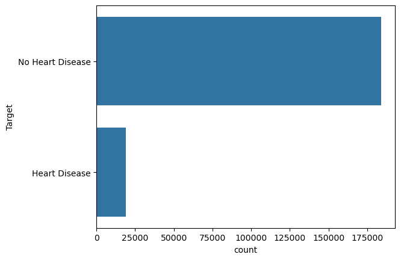
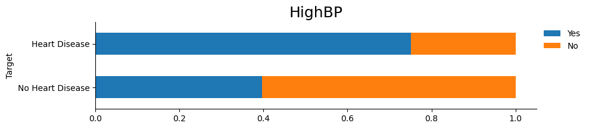
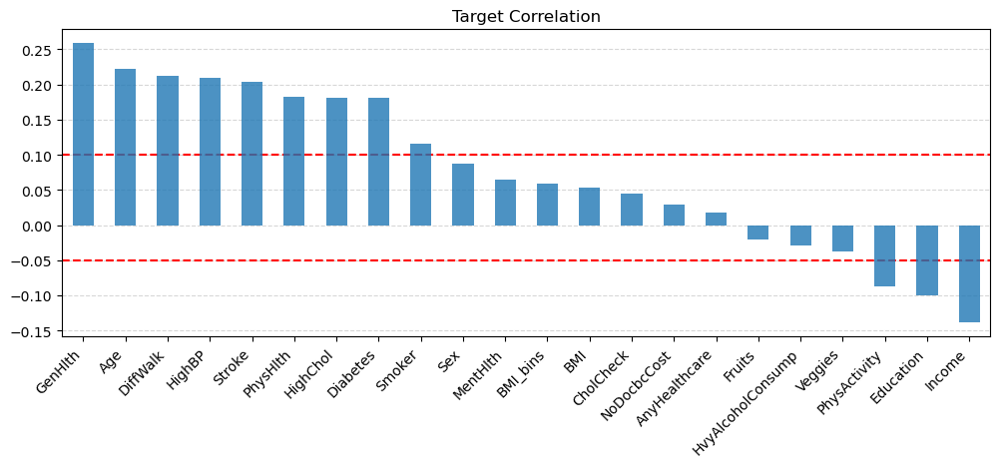
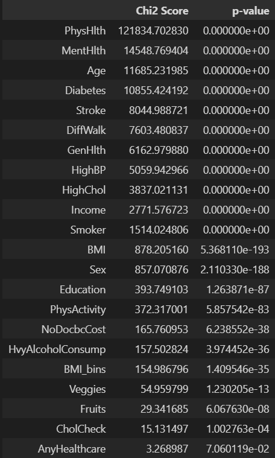

# Heart Disease Prediction

Heart disease continues to be a major public health issue in the United States, contributing to approximately 647,000 deaths annually. The condition, primarily caused by plaque buildup in coronary arteries, is further aggravated by risk factors such as high blood pressure, diabetes, smoking, and aging. Early detection and preventive measures are essential to mitigate adverse outcomes like heart attacks and sudden cardiac arrest.

## Data Overview

This study leverages data from the Behavioral Risk Factor Surveillance System (BRFSS), an annual health-related telephone survey conducted by the Centers for Disease Control and Prevention (CDC). The primary objective is to predict the likelihood of heart disease in individuals based on health-related behaviors and chronic conditions, enabling timely identification of at-risk individuals.

[Explore the project here](https://certifiedoxygen-heart-disease-prediction-project-app-nmkxm2.streamlit.app/).

## Exploratory Data Analysis (EDA)

### Key Observations

- **Class Imbalance**: The dataset exhibited significant imbalance, with approximately 10% of observations belonging to the positive class (heart disease) and 90% to the negative class (no heart disease).

- **Feature Types**: Most features in the dataset were binary or ordinal, making them well-suited for classification tasks.

- **Binary Feature Distributions**: The distribution of binary features was visualized across both target classes to compare proportions between "Heart Disease" and "No Heart Disease" groups.  
  

- **Correlation Analysis**:

  - A Pearson correlation matrix highlighted relationships among variables.
  - Strong positive correlation: Physical Health and General Health.
  - Strong negative correlation: Income and General Health.

- **Target Correlation**: The relationship between individual features and the target variable was examined to identify significant predictors of heart disease.  
  

## Feature Selection

- **Filtering Methods**:

  - Features were evaluated using Pearson correlation, chi-squared (chi²) scores, and mutual information scores.
  - Features with a chi² score above 250 were selected, aligning with the findings from Pearson correlation analysis.
  
  

- **Recursive Feature Elimination (RFE)**:

  - RFE was applied to identify features that optimized the F1 score. The results were consistent with the features selected using chi² scores.
  - A final set of 15 features was chosen for model training.

## Model Development

- **Addressing Class Imbalance**:

  - Various resampling techniques, including Random Undersampling, Random Oversampling, and SMOTE (Synthetic Minority Oversampling Technique), were tested.
  - SMOTE emerged as the most effective method for handling the class imbalance.

- **Model Selection**:

  - A range of models was tested, including Random Forest, Decision Trees, XGBoost, K-Nearest Neighbors, Gaussian Naive Bayes, and Logistic Regression.
  - Logistic Regression outperformed other models and was selected as the final model.

## Hyperparameter Tuning

- **Grid Search Optimization**:

  - Grid Search was used to identify the best hyperparameters for the Logistic Regression model.
  - The primary objective was to maximize recall, as correctly identifying true positive cases of heart disease is critical.

- **Importance of Recall**:

  - Missing a positive case (false negative) in heart disease prediction can lead to severe consequences, such as delayed diagnosis or treatment.
  - Maximizing recall ensures that false negatives are minimized, enhancing the likelihood of detecting heart disease cases early.

- **Final Model Implementation**:

  - The best hyperparameters identified through Grid Search were applied to refit the Logistic Regression model, achieving improved performance with a focus on recall.

## Streamlit App

A Streamlit app was developed to provide an interactive interface for users to explore the model's predictions. The app allows users to input individual health parameters and receive a prediction on their likelihood of having heart disease. 